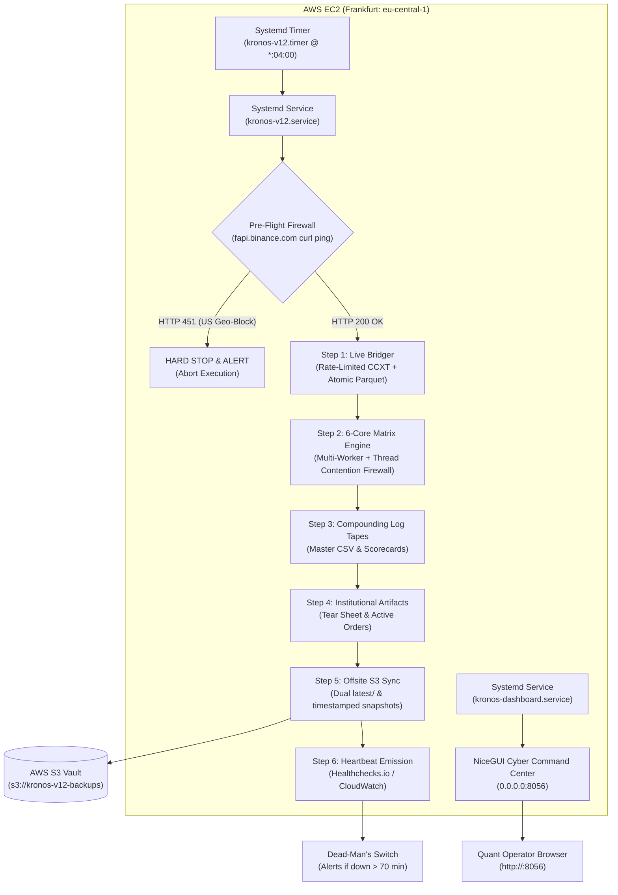

# Kronos V12: Canonical AWS EC2 Deployment Runbook
**Universal 6-Core Production Architecture & Cloud Hardening Guide**

---

## 1. Cloud Architectural Blueprint



---

## 2. Pre-Requisites & AWS Resource Sizing

### A. AWS Region Selection (CRITICAL)
- **Mandatory Regions:** `eu-central-1` (Frankfurt, Germany) or `ap-northeast-1` (Tokyo, Japan).
- **Prohibited Regions:** `us-east-1`, `us-west-2`, or any US territory.  
  *Rationale:* Binance Futures permanently returns **HTTP 451 (Unavailable For Legal Reasons)** to all US IP ranges. The automated pre-flight firewall will refuse to execute in US regions.

### B. Instance Recommendation
- **Instance Type:** `t3.large` or `c6i.large` (2 vCPUs, 4GB to 8GB RAM).
- **Storage:** 40 GB gp3 SSD (Baseline 3,000 IOPS / 125 MB/s throughput).
- **Operating System:** Ubuntu 22.04 LTS or Ubuntu 24.04 LTS (x86_64).

### C. Security Group (Firewall Rules)
| Type | Port Range | Protocol | Source | Purpose |
| :--- | :--- | :--- | :--- | :--- |
| **SSH** | 22 | TCP | Your Static IP (`/32`) | Secure Terminal Access |
| **HTTP** | 80 | TCP | `0.0.0.0/0` (or Your IP) | NiceGUI Dashboard via Nginx Reverse Proxy |
| **HTTPS** | 443 | TCP | `0.0.0.0/0` (or Your IP) | Secure SSL Dashboard (Certbot) |
| **Custom TCP** | 8056 | TCP | Your Static IP (`/32`) | Direct NiceGUI Port (Backend) |

*(Optional: Use AWS SSM Session Manager to eliminate open Port 22 entirely).*

### D. IAM Role (EC2 Instance Profile)
Attach an IAM role to the EC2 instance with the following inline policy for S3 backups:
```json
{
  "Version": "2012-10-17",
  "Statement": [
    {
      "Effect": "Allow",
      "Action": [
        "s3:PutObject",
        "s3:GetObject",
        "s3:ListBucket"
      ],
      "Resource": [
        "arn:aws:s3:::YOUR-KRONOS-S3-BUCKET",
        "arn:aws:s3:::YOUR-KRONOS-S3-BUCKET/*"
      ]
    },
    {
      "Effect": "Allow",
      "Action": [
        "cloudwatch:PutMetricData"
      ],
      "Resource": "*"
    }
  ]
}
```

---

## 3. Step-by-Step Deployment Instructions

### Step 1: Transfer Code to EC2 Instance
From your local terminal, transfer the `v12_standalone` directory:
```bash
# Using rsync over SSH:
rsync -avz --exclude '.git' --exclude '__pycache__' --exclude '.venv' \
  f:/kronos_v1_alt/v12_standalone/ ubuntu@<EC2_PUBLIC_IP>:/home/ubuntu/kronos_v12/
```
*(Or push to a private Git repository and clone into `/home/ubuntu/kronos_v12`).*

### Step 2: Run 1-Click EC2 Provisioning
SSH into the instance and run the bootstrap script:
```bash
ssh ubuntu@<EC2_PUBLIC_IP>
cd /home/ubuntu/kronos_v12
chmod +x deploy/setup_ec2.sh
bash deploy/setup_ec2.sh
```

**What `setup_ec2.sh` automatically performs:**
1. Tests Binance Futures API geo-accessibility (`curl https://fapi.binance.com/fapi/v1/ping`).
2. Installs system packages: `python3`, `python3-pip`, `python3-venv`, `curl`, `git`, `build-essential`.
3. Creates isolated virtual environment in `/home/ubuntu/kronos_v12/.venv`.
4. Installs frozen production dependencies from `requirements.txt`.
5. Prepares `.env` configuration file from `.env.example`.
6. Configures, enables, and starts the systemd services:
   - `kronos-v12.timer` (Hourly pipeline scheduled at `*:04:00`).
   - `kronos-dashboard.service` (24/7 NiceGUI Command Center on port 8056).

### Step 3: Configure Environment Variables (`.env`)
Edit `/home/ubuntu/kronos_v12/.env`:
```bash
nano .env
```
Fill in the following fields:
```env
# AWS & Offsite Storage
AWS_DEFAULT_REGION=eu-central-1
S3_BUCKET=your-kronos-v12-bucket-name

# Dead-Man's Switch Alerting (Healthchecks.io or Cronitor)
HEARTBEAT_URL=https://hc-ping.com/your-uuid-here

# Exchange Keys (Read-Only for REST / Authenticated private endpoints)
BINANCE_API_KEY=your_key_here
BINANCE_API_SECRET=your_secret_here

# Dashboard Configuration
NICEGUI_HOST=0.0.0.0
NICEGUI_PORT=8056
```

---

## 4. Verification & Operational Management

### A. Run Immediate Test Execution
Verify the full 6-step pipeline executes cleanly:
```bash
cd /home/ubuntu/kronos_v12
./pipeline_v12.sh
```
Expected output:
- `[0/6] Pre-Flight Passed: Binance Futures connectivity confirmed (HTTP 200).`
- `[1/6] Live Ingestion & Gap Filling completed.`
- `[2/6] Executing Clean 6-Core Matrix & Counterfactual Telemetry completed.`
- `[3/6] Strict Log-Compounding Tapes exported.`
- `[4/6] Institutional Executive Artifacts generated.`
- `[5/6] Offsite State & Ledger Backup to AWS S3 synchronized.`
- `[6/6] Emitting Pipeline Liveness Heartbeat sent.`

### B. Monitor Hourly Systemd Timer
```bash
# Check timer schedule and next trigger time:
systemctl list-timers | grep kronos

# Check timer status:
systemctl status kronos-v12.timer

# View pipeline execution logs:
journalctl -u kronos-v12.service -f -n 100
```

### C. Access NiceGUI Command Center Dashboard
Open your web browser and navigate to:
```text
http://<EC2_PUBLIC_IP>          # Direct HTTP Port 80 (via Nginx Reverse Proxy)
# or
http://<EC2_PUBLIC_IP>:8056     # Direct Backend Port
```

**Key Dashboard Features (Latest V12.2 Production Build):**
* **Individual Coin Deep Research (`/coin/{symbol}`):** Dedicated tear sheet and 3-pane quantitative Plotly chart for any of the 725 liquid shards (e.g. `/coin/AVAX`, `/coin/RUNE`, `/coin/SOL`).
* **Veto Flight Recorder & Dodged Bullets:** Live breakdown of dodged false breakout stops vs missed upside with full Quasar multi-page sorting and search.
* **Universal Asset Scorecard:** Comprehensive log-space profit factor, edge per trade, capital multiple, and underwater drawdown.
* **Chronological Execution Timeline:** Draggable calendar range swimlane Gantt charts.
* **Auto-Reconnect Guard:** Automatic background reconnection with stale page reload fallback.

To inspect or restart dashboard service:
```bash
# Check status:
systemctl status kronos-dashboard.service
sudo systemctl status nginx

# Restart:
sudo systemctl restart kronos-dashboard.service

# View dashboard logs:
journalctl -u kronos-dashboard.service -f
```

### D. Alternative: 1-Click Containerized Deployment (Docker Compose)
If you prefer deploying via Docker on EC2 or AWS ECS:
```bash
cd /home/ubuntu/kronos_v12
cp .env.example .env && nano .env

# Build and launch both Dashboard and Hourly Pipeline containers in the background:
docker compose up -d

# View running containers:
docker compose ps

# View real-time logs:
docker compose logs -f dashboard
docker compose logs -f pipeline
```
Accessible immediately at `http://<EC2_PUBLIC_IP>:8056`.

---

## 5. Automated Failure Recovery & Disaster Prevention

| Vulnerability | Hardened Solution | Verified Location |
| :--- | :--- | :--- |
| **Binance US Block (HTTP 451)** | Pre-Flight curl check aborts pipeline instantly before API rate counters or execution. | `pipeline_v12.sh` & `setup_ec2.sh` |
| **Binance 418 IP Ban Circuit Breaker** | Mid-ingest `BANNED` event trips on HTTP 418, instantly halting all worker threads across the pool. | `config/ingestion/live_bridger.py` |
| **Binance 429 Rate Burst** | Token-bucket `RateLimiter(max_per_second=3.0)` and worker scale to 10. | `config/ingestion/live_bridger.py` |
| **Corrupted Shards / Zero-Byte Overwrites** | `atomic_to_parquet()` writes to `.tmp` and renames atomically via filesystem inode swap (`os.replace`). | `config/ingestion/live_bridger.py` |
| **Pipeline Process Collision** | File lock firewall (`flock` on `/tmp/kronos_v12_hourly.lock`) cleanly exits duplicate runs with code 3. | `pipeline_v12.sh` & `kronos-v12.service` |
| **Downtime Retention Gap** | Paginated multi-batch historical fetching with 30-day cutoff warning. | `config/ingestion/live_bridger.py` |
| **Host Loss / Disaster Recovery** | Dual `latest/` and snapshot S3 sync (`backup_to_s3.py`) + 1-Click blank host restore (`restore_from_s3.py`). | `scripts/backup_to_s3.py` & `scripts/restore_from_s3.py` |
| **Trade Signal Operator Alerting** | Automated AWS SNS email dispatcher sending formatted trade tables for newly entered signals. | `scripts/notify_signals_sns.py` |
| **Silent Job Failure / Dead Host** | Dead-man's switch heartbeat ping via Healthchecks.io / CloudWatch. | `scripts/send_heartbeat.py` |
| **Environment Drift** | Strictly pinned dependencies (`requirements.txt`) & automated 36-test pytest compliance suite. | `requirements.txt` & `tests/` |

---

## 6. One-Click Disaster Recovery (Blank EC2 Instance)

If an EC2 instance is terminated or replaced, you can restore full operational state in seconds from your S3 backup:

```bash
# 1. On your fresh EC2 instance, clone or copy v12_standalone
cd /home/ubuntu/kronos_v12

# 2. Run the 1-click restore utility:
# Restores trades.parquet, scorecard.parquet, sync_state.json, CSVs, and tear sheets
python scripts/restore_from_s3.py --bucket your-s3-bucket-name

# (Optional: also restore all raw & exotic historical shard parquets)
python scripts/restore_from_s3.py --bucket your-s3-bucket-name --include-shards

# 3. System is immediately primed to resume execution:
./pipeline_v12.sh
```
