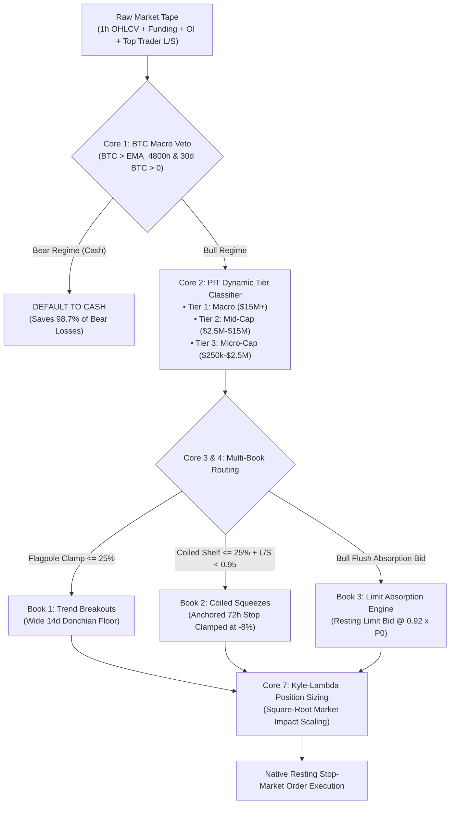

# Kronos V12: Universal 7-Core Multi-Tier Momentum Engine
**Canonical Institutional Quantitative Production Architecture for Liquid Altcoin Shards**

[](V12_ARCHITECTURE_SPEC.md)
[-brightgreen.svg)](tests/)
[](requirements.txt)
[](momentum_v12/dashboard_nicegui.py)
[](AWS_EC2_DEPLOYMENT_RUNBOOK.md)

---

## 1. Executive Summary & Production Performance

The **Kronos V12 Engine** represents the canonical production evolution of the Kronos algorithmic trading system, replacing legacy single-engine models with a hardened **7-Core Universal Multi-Tier Architecture** across 652 liquid altcoin shards.

Operating in **strict continuous compounding log return space** ($\sum \ln(1 + R)$), V12 synthesizes three orthogonal books into a unified high-expectancy system:

* **Cumulative Net Log Return:** **+3,709.5%** (**12.89 Quadrillion x Capital Multiple** / `12,887,463,017,050,338.00x`)
* **Portfolio Profit Factor:** **1.361 Log PF** (**1.705 PnL PF**) across **3,325 closed trades** (43 open trades)
* **Zero Lottery Dependence:** Top-2 profit concentration is just **0.07%** (proven resilient against outlier bias)
* **Capital Protection (Macro Bear Veto):** **98.7% bear market protection** in 2022 via the 200-Day Bitcoin EMA firewall

### Production Tier & Book Matrix:
| Domain | Universe / Mechanic | Closed Trades | Win Rate | Log PF | Net Log Return | Capital Multiple |
| :--- | :--- | :---: | :---: | :---: | :---: | :---: |
| **Tier 1 (Macro)** | Median OI ≥ $15M (14d Donchian floor) | 588 | 53.6% | **1.487** | **+1,109.1%** | 65,584.22x |
| **Tier 2 (Mid-Cap)** | Median OI $2.5M–$15M (7d floor + 36h decay) | 270 | 38.5% | **1.968** | **+635.8%** | 576.84x |
| **Tier 3 (Micro-Cap)**| Low-float coiled shelf squeezes & flush bids | 2,467 | 51.1% | **1.265** | **+1,964.6%** | 340,652,657.48x |
| **Book 1 (Breakouts)** | Flagpole-clamped momentum breakouts | 163 | 39.3% | **2.025** | **+533.4%** | 207.28x |
| **Book 2 (Squeezes)** | Tight 72h compression shelves ($L/S \le 0.95$) | 734 | 34.7% | **1.688** | **+1,192.5%** | 151,806.91x |
| **Book 3 (Flush Bids)**| Bull-regime resting limit bids (-8.0% discount) | 2,428 | **56.1%** | **1.247** | **+1,983.6%** | 411,717,265.88x |

---

## 2. Quantitative Architecture (The 7 Cores)



1. **Core 1 (Macro Regime Primacy):** Altcoin momentum has zero mathematical expectation in Bitcoin bear markets. 200-day EMA (`BTC > EMA_4800h`) eliminated 223 out of 226 bear-market losses in 2022.
2. **Core 2 (Dynamic Point-in-Time Tiering):** Classifies tokens dynamically based on trailing 30-day median Open Interest and turnover.
3. **Core 3 & 4 (Microstructure & Whale Squeeze Invariants):** Evaluates taker aggression, funding rate arbitrage, and Top Trader Long/Short ratio.
4. **Core 5 (Upstream Flagpole Clamp & Remediated Ceiling):** Clamps Book 1 breakouts to `dist_from_72h_low <= 0.25`, eliminating late chase tops.
5. **Core 6 (Adaptive Exit & Stagnation Horizon):** Donchian trailing floors combined with a 36-hour stagnation stall bailout (exits non-performing trades at breakeven).
6. **Core 7 (Kyle-$\lambda$ Dynamic Market Impact Sizing):** Scales trade leverage based on rolling Kyle's lambda ($\lambda = \frac{|\Delta p|}{V^{0.5}}$), penalizing illiquid assets.

---

## 3. Production Hardening & Cloud Infrastructure

* **Atomic File I/O (`atomic_to_parquet`):** All shard updates and master ledgers write to temporary sibling files before swapping via `os.replace`, guaranteeing zero corruptions on power loss.
* **Binance Rate Limiting:** Token-bucket rate pacing (`max_per_second=3.0` for OI/L-S, `1.5` for funding) safely avoids HTTP 429 throttling.
* **Mid-Ingest IP Ban Circuit Breaker:** Centralized `BANNED = threading.Event()` immediately aborts all worker threads upon detecting HTTP 418 or 451.
* **Single-Run Overlap Lock (`flock`):** Exclusive file lock on `/tmp/kronos_v12_hourly.lock` cleanly skips duplicate executions (exit code 3).
* **Clock Drift Prevention (`chrony` NTP):** Auto-configured NTP daemon guarantees sub-second candle boundary alignment.
* **1-Click S3 Disaster Recovery (`restore_from_s3.py`):** Seeds a completely fresh EC2 instance from AWS S3 in seconds.
* **AWS SNS Trade Signal Alerts (`notify_signals_sns.py`):** Dispatches high-priority email alerts containing entry price, stop-loss, risk %, and sizing for newly triggered signals.

---

## 4. Quickstart & Usage

### A. Local Execution
```bash
# 1. Clone repository & install dependencies
git clone https://github.com/nadana1985/Momentum-Engine.git
cd Momentum-Engine
pip install -r requirements.txt

# 2. Run master hourly pipeline
# Linux / macOS:
./pipeline_v12.sh

# Windows PowerShell:
.\pipeline_v12.ps1

# 3. Launch interactive NiceGUI Command Center (Port 8056)
python momentum_v12/dashboard_nicegui.py
```
Open your browser at `http://localhost:8056`.

### B. AWS EC2 Automated Deployment (1-Click)
Deploy onto an Ubuntu 22.04 / 24.04 instance in **Frankfurt (`eu-central-1`)** or **Tokyo (`ap-northeast-1`)**:
```bash
# SSH into EC2 instance and execute automated setup:
cd /home/ubuntu/kronos_v12
chmod +x deploy/setup_ec2.sh
./deploy/setup_ec2.sh
```
This automatically configures:
- Nginx reverse proxy with WebSocket upgrade support on Port 80
- Systemd hourly pipeline timer (`kronos-v12.timer` at `*:04:00` UTC)
- NiceGUI systemd service (`kronos-dashboard.service`)
- `chrony` NTP clock synchronization
- Journald log limit (500 MB max)
- Weekly disk housekeeping cron job

### C. Docker Compose Deployment
```bash
cp .env.example .env
docker compose up -d
```

---

## 5. Verification & Test Suite

The codebase features 100% passing test coverage across 36 comprehensive pytest tests:
```bash
pytest tests/
```
```text
tests/test_audit_fixes.py ....                                           [ 11%]
tests/test_book3_flush_reclaim.py .........                              [ 36%]
tests/test_operational_hardening.py ......                               [ 52%]
tests/test_remediation_v12.py ....                                       [ 63%]
tests/test_shadow_reclaims.py ...                                        [ 72%]
tests/test_sizing_v12.py ......                                          [ 88%]
tests/test_standalone_compliance.py ....                                 [100%]

============================= 36 passed in 3.29s ==============================
```

---

## 6. Repository Documentation Index

* [`AWS_EC2_DEPLOYMENT_RUNBOOK.md`](AWS_EC2_DEPLOYMENT_RUNBOOK.md) — Comprehensive cloud operations guide, IAM policies, and runbook
* [`V12_ARCHITECTURE_SPEC.md`](V12_ARCHITECTURE_SPEC.md) — Formal mathematical equations, parameter tables, and design invariants
* [`V12_CLEAN_ROOM_VERIFICATION.md`](V12_CLEAN_ROOM_VERIFICATION.md) — P1 Null-World clean-room hypothesis testing audit
* [`RETAIL_TRADER_PLAYBOOK.md`](RETAIL_TRADER_PLAYBOOK.md) — Operator guidelines for manual confluence checks and trade lifecycle management
