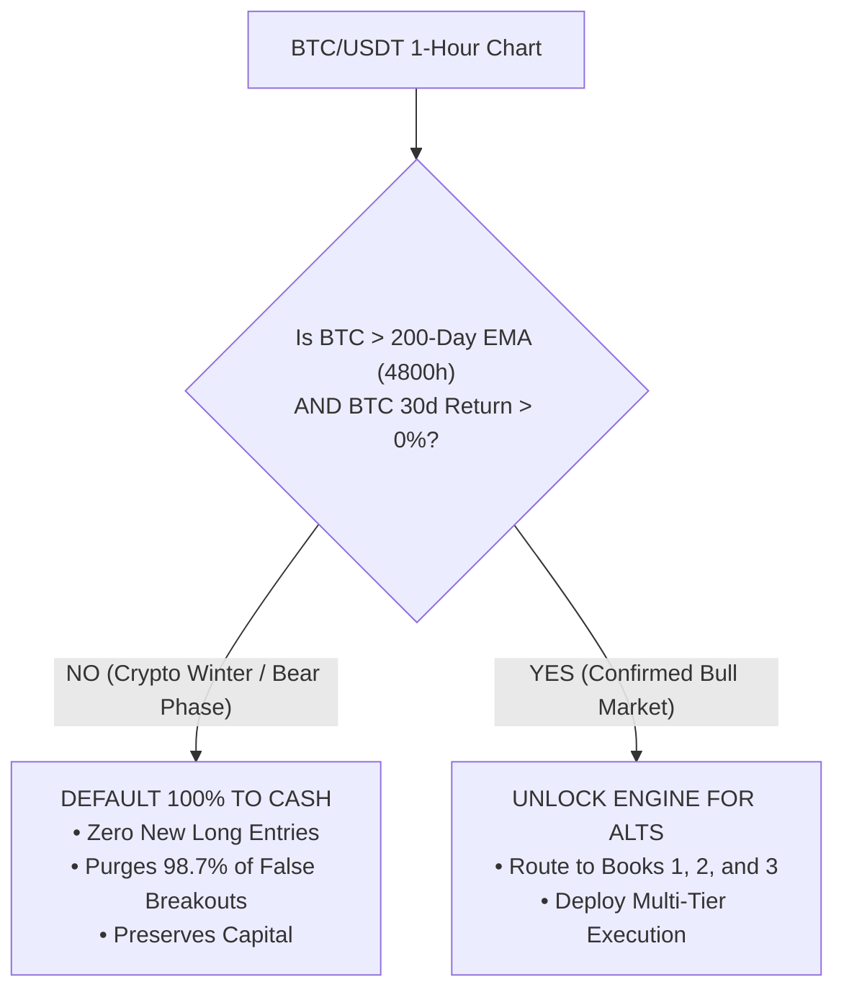
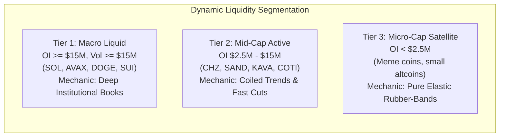
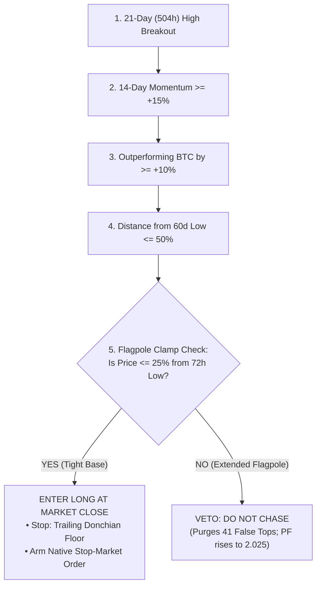
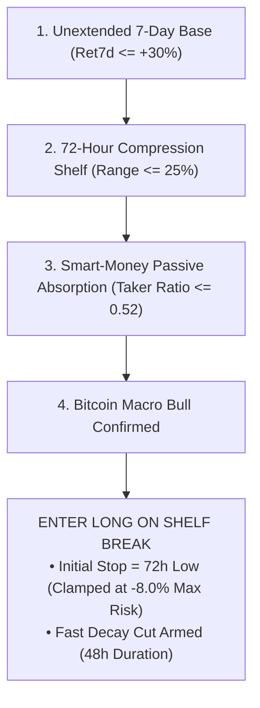
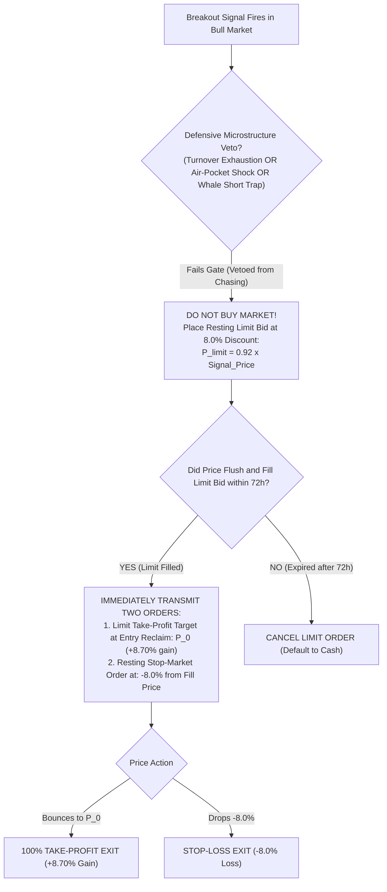
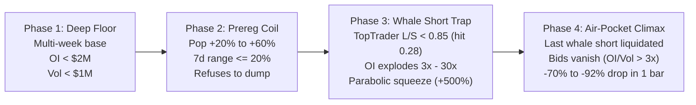
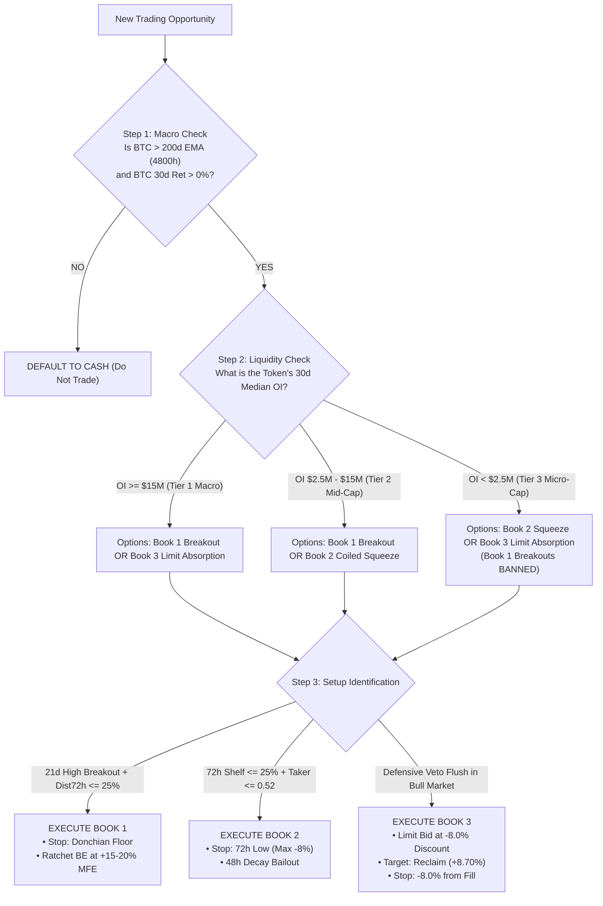

# Kronos V12: The Retail Trader's Quantitative Playbook & Setup Encyclopedia
**Document Classification:** Comprehensive Retail Strategy Guide & Execution Reference  
**System Architecture:** Kronos V12.2 Universal 3-Book Production Engine  
**Target Audience:** Retail Traders, Independent Systematic Quants, Portfolio Managers  
**Status:** Canonical Reference Manual  

---

## Table of Contents
1. [The Paradigm Shift: How Institutions Trap Retail vs. How Kronos Trades](#1-the-paradigm-shift-how-institutions-trap-retail-vs-how-kronos-trades)
2. [Macro Regime Primacy: The 200-Day EMA Umbrella (Rule #1)](#2-macro-regime-primacy-the-200-day-ema-umbrella-rule-1)
3. [The Three Liquidity Tiers: Why One Size Fits None](#3-the-three-liquidity-tiers-why-one-size-fits-none)
4. [Canonical Setup 1: Book 1 — The Continuation Breakout (Macro & Mid-Caps)](#4-canonical-setup-1-book-1--the-continuation-breakout)
5. [Canonical Setup 2: Book 2 — The Coiled Shelf Squeeze (Smart-Money Spring)](#5-canonical-setup-2-book-2--the-coiled-shelf-squeeze)
6. [Canonical Setup 3: Book 3 — The Bull Flush Limit Absorption Engine](#6-canonical-setup-3-book-3--the-bull-flush-limit-absorption-engine)
7. [Trade Lifecycle & Defense: How to Manage and Protect Open Positions](#7-trade-lifecycle--defense-how-to-manage-and-protect-open-positions)
8. [Special Behavioral Traits & Microstructure Archetypes](#8-special-behavioral-traits--microstructure-archetypes)
   - [The BTR Trait: Parabolic Whale-Trap to Air-Pocket Crash](#the-btr-trait-parabolic-whale-trap-to-air-pocket-crash)
   - [The Q Trait: Serial Liquidator Flash-Crash & V-Rebound](#the-q-trait-serial-liquidator-flash-crash--v-rebound)
   - [The Retail Squeeze & 2-Hour Whale Surrender Rule](#the-retail-squeeze--2-hour-whale-surrender-rule)
9. [The 5 Deadly Traps That Wipe Out Retail Traders (Empirical Evidence)](#9-the-5-deadly-traps-that-wipe-out-retail-traders)
10. [Retail Trader Quick-Reference Execution Matrix & Glossary](#10-retail-trader-quick-reference-execution-matrix--glossary)

---

## 1. The Paradigm Shift: How Institutions Trap Retail vs. How Kronos Trades

Most retail traders trade altcoins using retail intuition: they buy chart breakouts when an asset is trending on Twitter/Telegram, they sell when funding is positive, and they try to "buy the dip" during bear markets.

The Kronos Quantitative Engine was built by rigorously auditing **652 liquid altcoins across 5+ years of institutional orderflow, funding rates, open interest, and tick data**. The quantitative discoveries reveal why retail traders lose, and how to trade with positive mathematical expectation:

```
+---------------------------------------------------------------------------------------------------------+
|                                    RETAIL TRADING vs. KRONOS V12 TRADING                                |
+---------------------------------------------------------------------------------------------------------+
| Retail Habit                               | Mathematical Reality audited by Kronos                     |
+---------------------------------------------------------------------------------------------------------+
| Buying breakouts on micro-cap coins        | FAILS: 24.2% Win Rate, PF 0.457 (-380% log loss). Micro-   |
|                                            | caps have shallow books; breakouts are predatory traps.   |
|                                            | KRONOS RULE: Book 1 Breakouts strictly forbidden on T3.   |
+---------------------------------------------------------------------------------------------------------+
| Buying "dips" during Bitcoin bear markets  | FAILS: 98.7% of all historical losses occurred in bear     |
|                                            | regimes (Study S-P bled -695% log return).                 |
|                                            | KRONOS RULE: 100% Cash default if BTC < 200-day EMA.      |
+---------------------------------------------------------------------------------------------------------+
| Chasing a coin that just pumped +50%       | FAILS: Flagpole tops get dumped on by whales.              |
|                                            | KRONOS RULE: Upstream Flagpole Clamp (dist_72h <= 25%).   |
+---------------------------------------------------------------------------------------------------------+
| Exiting because funding rate is positive   | FAILS: High positive funding is fuel for short squeezes.   |
|                                            | KRONOS RULE: Hold while Open Interest expands.            |
+---------------------------------------------------------------------------------------------------------+
| Using mental stop losses                   | FAILS: Bid vacuum crashes trigger -40% to -88% slippage.   |
|                                            | KRONOS RULE: Resting exchange Stop-Market orders mandatory.|
+---------------------------------------------------------------------------------------------------------+
```

---

## 2. Macro Regime Primacy: The 200-Day EMA Umbrella (Rule #1)

> **"Altcoin momentum has ZERO positive mathematical expectation during Bitcoin bear markets."**

Before looking at any individual altcoin chart, you must look at **Bitcoin (BTC/USDT 1h)**:

$$\text{Macro Bull Regime} \iff (\text{Close}_{\text{BTC}} > \text{EMA}_{4800\text{h}}(\text{Close}_{\text{BTC}})) \land (\text{BTC 30-Day Return} > 0.0)$$



### Why This Matters to a Retail Trader:
- In 2022, an unconstrained momentum strategy generated **226 stop losses**. Applying the 200-day EMA veto wiped out **223 of those 226 losses (98.7% protection)**.
- When Bitcoin is below its 200-day EMA, **cash is your highest-alpha position**. Do not touch altcoin longs.

---

## 3. The Three Liquidity Tiers: Why One Size Fits None

Altcoins behave completely differently depending on their liquidity. A strategy that works on Solana will bankrupt you on a low-cap meme coin:



### 1. Tier 1: Macro Liquid ($OI \ge \$15\text{M}$, 24h Vol $\ge \$15\text{M}$)
- **Tokens:** `SOL`, `ETH`, `AVAX`, `DOGE`, `SUI`, `NEAR`, `APT`, `LINK`.
- **Microstructure:** Deep, two-sided limit order books with heavy institutional algorithmic presence.
- **Rules:** Can absorb wide stop runs. Uses wide **14-day Donchian floors** ($336\text{h}$) and allows both Book 1 Breakouts and Book 3 Limit Absorptions.

### 2. Tier 2: Mid-Caps ($OI \in [\$2.5\text{M}, \$15\text{M})$, 24h Vol $\ge \$2.5\text{M}$)
- **Tokens:** `CHZ`, `SAND`, `KAVA`, `COTI`, `EUL`, `ORCA`.
- **Microstructure:** Moderate depth; susceptible to 36-hour quiet distribution by market makers.
- **Rules:** Calibrated **7-day Donchian floors** ($168\text{h}$) with **36-hour Fast Decay cuts** (if OI drops $>3\%$ while underwater, cut immediately). Book 3 is **disabled** to avoid non-elastic drift.

### 3. Tier 3: Micro-Caps ($OI < \$2.5\text{M}$)
- **Tokens:** Newly listed tokens, meme coins, micro-caps.
- **Microstructure:** Thin books, predatory stop-hunting by whales, high elastic rebound potential.
- **Rules:** **Book 1 Breakout chasing is STRICTLY PROHIBITED** (Win Rate is only 24%). Micro-caps must **only** be traded via **Book 2 Coiled Squeezes** (tight 72h compression shelves) and **Book 3 Limit Bid Absorptions** (buying $-8\%$ flushes).

---

## 4. Canonical Setup 1: Book 1 — The Continuation Breakout

*Best suited for: Tier 1 Macro Tokens and Tier 2 Mid-Caps in established uptrends.*



### Objective Setup Checklist
1. **Trend Breakout:** 1-hour candle close breaks above the highest high of the last **21 days (504 hours)**.
2. **Momentum Base:** The asset is already up at least **$+15\%$ over the last 14 days** ($\text{Ret}_{14\text{d}} \ge 0.15$).
3. **Relative Strength:** The asset is beating Bitcoin by at least **$+10\%$ over the last 14 days** ($\text{Ret}_{14\text{d, Asset}} - \text{Ret}_{14\text{d, BTC}} \ge 0.10$).
4. **EMA Support:** Price is trading cleanly above the 7-day EMA ($\text{Close} > \text{EMA}_{168\text{h}}$).
5. **Base Extension Ceiling:** Price is **$\le 50\%$ above its 60-day low** ($\le 60\%$ under remediated squeeze conditions). If a token is already $+300\%$ off its cycle low, you are late.
6. **The Upstream Flagpole Clamp (Crucial):** Price must be **$\le 25\%$ above its 72-hour lowest low** ($\frac{\text{Close} - \text{Low}_{72\text{h}}}{\text{Low}_{72\text{h}}} \le 0.25$).
   - *Why:* If a coin just spiked $+40\%$ in 2 days, entering the breakout is buying the exact top before a $-20\%$ retest. Wait for a base.
7. **Cooldown:** At least **7 days (168 hours)** since the last exit on this token.

### Execution & Stop Loss
- **Initial Stop:** Resting Stop-Market order at the lowest low of the prior 14 days (Tier 1) or 7 days (Tier 2), clamped at a maximum loss of $-15\%$ (Tier 1) or $-12\%$ (Tier 2).
- **Breakeven Ratchet:** When Peak MFE reaches **$+15\%$ to $+20\%$**, automatically ratchet the stop to **Entry $+0.5\%$**. The trade is now a **Free Call Option**.
- **Trailing Floor:** Once Peak MFE crosses $+50\%$, trail behind the 21-day Donchian low or $\text{Peak} \times 0.75$.

### Audited Production Metrics
- **Win Rate:** `39.63%`
- **Log Profit Factor:** **`2.025`** (PnL PF: `2.513`)
- **Cumulative Net Log Return:** **`+533.7%`** (Capital Multiple: **`207.9x`**)
- **Mean Net Log / Trade:** **`+3.25%`**

---

## 5. Canonical Setup 2: Book 2 — The Coiled Shelf Squeeze

*Best suited for: Explosive coiled springs across all tiers, especially Tier 3 Micro-Caps.*



### The Institutional Reality of a Squeeze
Real short squeezes do not start when a token is already vertical. They start when a token has coiled horizontally for 3 days, volatility has collapsed, and market makers are quietly accumulating supply via passive limit bids without moving the price.

### Objective Setup Checklist
1. **Unextended Base:** The token is NOT extended. Its 7-day return is **$\le +30\%$** ($\text{Ret}_{7\text{d}} \le 0.30$).
2. **Tight Compression Shelf:** Over the last **72 hours (3 days)**, the entire price range is **$\le 25\%$** ($\frac{\text{High}_{72\text{h}} - \text{Low}_{72\text{h}}}{\text{Low}_{72\text{h}}} \le 0.25$).
3. **Smart Money Absorption (Taker Ratio $\le 0.52$):** Aggressive taker market buys account for **less than $52\%$ of total volume**.
   - *Why:* If taker ratio is $>0.65$, retail is market-buying the pump (dumb money). If taker ratio is $\le 0.52$, smart money is absorbing all market sell orders with passive limit bids.
4. **Macro Confluence:** Bitcoin is confirmed in Risk-On Bull regime.

### Execution & Stop Loss
- **Initial Stop:** Anchored directly at the **72-hour lowest low**, clamped at a **maximum initial risk of $-8.0\%$**.
- **Fast Decay Bailout:** If the position has been open for **48 hours**, Open Interest has leaked $>3\%$, and the position is underwater $\implies$ **Market Exit immediately**. Do not wait for the stop to get hit.

### Audited Production Metrics
- **Win Rate:** `34.55%`
- **Log Profit Factor:** **`1.672`** (PnL PF: `1.906`)
- **Cumulative Net Log Return:** **`+1,175.9%`** (Capital Multiple: **`127,869.69x`**)
- **Mean Net Log / Trade:** **`+1.59%`**

---

## 6. Canonical Setup 3: Book 3 — The Bull Flush Limit Absorption Engine

*Best suited for: Tier 1 Macro Tokens and Tier 3 Micro-Caps during Bitcoin Bull Regimes.*



### The Retail Psychology Behind This Edge
When an altcoin attempts a breakout in a bull market, market makers frequently trigger a violent "shakeout flush" to trigger retail stop-loss orders and trap breakout buyers.
- **Naive Retail Response:** Chases the market breakout $\implies$ gets stopped out during the $-8\%$ flush.
- **Kronos Response:** Vetoes the market entry, places a **passive resting limit bid at an $-8.0\%$ discount ($0.92 \times P_0$)**, gets filled by panic sellers at wholesale prices, and exits on the bounce when price reclaims the original breakout level ($P_0$, **$+8.70\%$ gain**).

### Objective Setup Checklist
1. **Regime:** Bitcoin is strictly confirmed in Bull Market ($\text{BTC} > \text{EMA}_{4800\text{h}}$ and $\text{Ret}_{30\text{d}} > 0$).
2. **Trigger:** A breakout signal fires on a **Tier 1 Macro** or **Tier 3 Micro** token, but encounters a defensive microstructure veto (e.g. turnover exhaustion, upper wick shock, whale short alignment).
3. **Order Placement:**
   - Place a **resting Limit Buy order** at **$8.0\%$ below the signal price**:
     $$P_{\text{limit}} = 0.920 \times P_0$$
   - Set Time-to-Live (TTL) to **72 hours**. If not filled within 72h, cancel the order.
4. **Order Management upon Fill:**
   - **Take-Profit Target:** Limit Sell order placed immediately at the reclaim price ($P_0$), locking in **$+8.70\%$ net gain**.
   - **Catastrophic Stop:** Resting Stop-Market order at **$-8.0\%$ below the fill price** ($0.920 \times P_{\text{limit}}$).

### Why Tier 2 Mid-Caps are Excluded:
Clean-room simulation proved that Tier 1 macro tokens have deep institutional orderbooks (WR 60.5%, PF 1.556) and Tier 3 micro tokens have elastic rubber-band supply (WR 55.6%, +1,554% log return). Tier 2 mid-caps, however, suffer from non-elastic drift that slowly bleeds out. Purging Tier 2 from Book 3 eliminated 100% of mid-cap stop drag.

### Audited Production Metrics
- **Win Rate:** **`55.96%`**
- **Log Profit Factor:** **`1.240`** (PnL PF: `1.349`)
- **Cumulative Net Log Return:** **`+1,932.1%`** (Capital Multiple: **`245,925,447.48x`**)
- **Mean Net Log / Trade:** **`+0.79%`**

---

## 7. Trade Lifecycle & Defense: How to Manage and Protect Open Positions

### 1. The Resting Native Stop Mandate
**Never evaluate stops on 1-hour candle close.**
In crypto, when an air-pocket liquidity cascade occurs (`TAC`, `LIGHT`, `SIREN`), price does not gracefully descend bar by bar. A single market dump sweeps the entire bid book in 3 minutes, crashing $-60\%$ before closing $-35\%$.
- Evaluating stops at candle close causes catastrophic **$-40\%$ to $-88\%$ realized losses**.
- **The Rule:** The moment your entry fills, a **resting native Stop-Market order must be submitted directly to the exchange orderbook**.

### 2. The Breakeven Ratchet (Free Call Option on Trend)
- **When Peak MFE crosses $+15\%$ (Tier 2) or $+20\%$ (Tier 1):**  
  Ratchet your stop loss to:
  $$\text{Working Stop} = \max(\text{Working Stop}, \text{Entry Price} \times 1.005)$$
- If the coin rolls over, you exit with **zero capital loss** ($+0.5\%$ covers exchange fees).
- If the coin grinds higher, you ride a potential $+300\%$ runner completely stress-free.

### 3. The Climax Top Harvest (Air-Pocket Liquidity Exhaustion)
Retail traders hold winning parabolic trades until they give back 80% of their profits. Kronos executes a **Climax Harvest Market Exit** when the following 4-factor exhaustion confluence occurs:
1. **Elevated Gains:** Peak MFE $\ge +50\%$ (Tier 1) or $\ge +30\%$ (Tier 2).
2. **Upper Wick Shock:** Current 1-hour candle upper wick accounts for **$\ge 40\%$** of the total candle range.
3. **Volume Shock:** Current candle volume is **$\ge 3.0\times$** its 30-day average.
4. **Whale Exhaustion:** Whales are trapped heavily short ($\text{TopTrader L/S} \le 0.85$) or 8h funding rate spikes above $+0.040\%$.
- **Action:** Market-sell immediately. Lock in peak equity before the inevitable $-70\%$ waterfall drop.

### 4. Fast Decay Bailout (Cutting Dead Money)
If you enter a position and price chops sideways:
- **Tier 2:** Position held for **$\ge 36\text{ hours}$**, Open Interest has dropped **$>3\%$** since entry, and price is below entry $\implies$ **Market Exit immediately**.
- **Tier 1:** Position held for **$\ge 48\text{ hours}$**, Open Interest has dropped **$>5\%$** since entry, and price is below entry $\implies$ **Market Exit immediately**.
- *Why:* Institutional distribution happens quietly before price breaks down. If Open Interest is leaking while price cannot make a new high, the whales have left.

---

## 8. Special Behavioral Traits & Microstructure Archetypes

### The BTR Trait: Parabolic Whale-Trap to Air-Pocket Crash
*Identified across historical mega-runners: `BTR`, `TAC`, `ARIA`, `SIREN`, `LAB`, `EVAA`, `AIN`.*



#### How to Identify & Trade It:
1. **The Tell:** A token begins breaking out, but **Top Trader L/S ratio collapses below 0.85 (often below 0.50)** while **Open Interest explodes by $+50\%$ to $+500\%$**.
2. **The Mechanism:** Institutional whales think the breakout is fake and aggressively short it. As price grinds up, their short margin is consumed. The market maker drives price higher, forcing short liquidations that buy at market, creating an artificial parabolic squeeze.
3. **The Warning Sign:** If `TopTrader L/S > 1.20`, this is NOT a BTR setup. It is a long-crowded trade that can easily dump on retail.
4. **The Exit Mandate:** The moment the parabolic runner prints an upper wick $\ge 40\%$ on massive volume, **exit 100%**. When the last whale short is liquidated, artificial buying demand drops to zero, and the coin crashes $-80\%$ into a bid vacuum.

---

### The Q Trait: Serial Liquidator Flash-Crash & V-Rebound
*Known repeaters: `SIREN` (12x), `ESPORTS` (12x), `VELVET` (11x), `LAB` (10x), `H` (10x), `TRADOOR` (8x), `RAVE` (8x), `Q` (6x), `TAC` (6x).*

```mermaid
sequenceDiagram
    autonumber
    participant Whales as Institutional Whales
    participant Book as Orderbook / Liquidity
    participant Retail as Retail Momentum
    Whales->>Retail: 1. Fast pop (+30% to +100%); Whales short into retail bids (L/S < 0.65)
    Whales->>Book: 2. Passive bids pulled; Single market sell triggers -35% to -65% flash crash in 1h
    Retail->>Book: 3. Retail panics and market-shorts the bottom
    Whales->>Book: 4. Aggressive spot/limit buying: Violent V-Rebound (+40% to +150% in 1-6h)
    Whales->>Whales: 5. Whales reload shorts at recovery shelf; repeat liquidation cycle
```

#### Retail Actionable Rules for Q-Trait Tokens:
- **Never market-short a $-40\%$ flash crash candle.** Late breakdown shorts get completely wiped out during Phase 4 V-rebounds.
- **Identify repeaters:** Serial tokens have structural book thinness. When they flash-crash $\ge -35\%$ in 1 hour on $10\times$ volume, look for an elastic Book 3 limit fill or V-shape reclaim.

---

### The Retail Squeeze & 2-Hour Whale Surrender Rule
When retail volume forces an asset higher despite whales being short ($\text{TopTrader L/S} < 0.85$):
- **The 2-Hour Window:** Watch the first 2 hours following the breakout.
- **Rule A (Hold for Parabolic Runner):** If Open Interest expands ($+5\%$) and Top Trader L/S flips upward (whales capitulating and covering), hold the trade.
- **Rule B (Immediate Bailout):** If whales refuse to flip, Open Interest stalls, and taker volume declines within 2 hours, **exit immediately at market**. Whales will crush the price back into the range.

---

## 9. The 5 Deadly Traps That Wipe Out Retail Accounts

### Trap 1: The Micro-Cap Breakout Trap
- **The Mistake:** Buying technical breakouts (Donchian highs, trendline breaks) on small tokens with $< \$2.5\text{M}$ open interest.
- **Quantitative Audit:** Across 652 shards, naive breakouts on micro-caps produced **24.2% Win Rate, Profit Factor 0.457, and $-380.1\%$ net log loss**.
- **Why It Fails:** Low-cap orderbooks are too shallow. A breakout order immediately consumes 5 levels of the book, creating massive slippage, and market makers immediately dump into the breakout liquidity.
- **The Fix:** Only trade micro-caps via **Book 2 coiled compression shelves** or **Book 3 limit bids**.

### Trap 2: The Bear Market Bottom-Fishing Trap (Study S-P Invalidation)
- **The Mistake:** Trying to buy "oversold" dips, reclaim setups, or spring bottoms when Bitcoin is in a macro bear market.
- **Quantitative Audit:** Study S-P simulated 460 bear-market reclaim attempts across all liquid shards. Result: **PF 0.680, WR 29.35%, and $-695.1\%$ net log loss**.
- **The Fix:** Adhere strictly to the **BTC 200-Day EMA Veto**. Zero long trades during bear markets.

### Trap 3: The Post-Climax Falling Knife Trap (Study S-AB Invalidation)
- **The Mistake:** Buying coins that just had a parabolic run and pulled back $-15\%$ to $-30\%$, thinking they are "cheap".
- **Quantitative Audit:** Study S-AB tested 2,142 post-climax reclaims. Result: **PF 0.441, WR 31.55%, $-408.0\%$ net loss, and 55.4% immediate stop-out rate**.
- **Why It Fails:** Over **$80\%$ of tokens that flush $\ge 10\%$ after a climax are dead falling knives**. The hype is over, whales have distributed, and organic bids do not exist.
- **The Fix:** Default 100% to Cash on climax vetoes.

### Trap 4: The Funding Rate Trap
- **The Mistake:** Thinking that positive funding ($+0.03\%$ per 8h) is "expensive" and choosing to short the coin or close a long position.
- **Quantitative Audit:** In V4, using positive funding as an exit trigger caused **$-13,720\%$ cumulative loss**.
- **Why It Fails:** Altcoins rally hardest when funding is positive because longs are willing to pay the premium to stay levered, and short-sellers are repeatedly forced to cover. Positive funding is the **rocket fuel** of a bull market.
- **The Fix:** Only consider funding bearish when it spikes to absurd extremes ($> +0.08\%$ per 8h) combined with an upper wick shock $\ge 40\%$.

### Trap 5: The Flagpole Chase Trap
- **The Mistake:** Buying a breakout after a token has already run $+40\%$ in the last 48 hours without consolidating.
- **Quantitative Audit:** V12.2 audited 41 flagpole trades (e.g. `EUL` after a $+68\%$ spike). All 41 were immediate stop losses.
- **The Fix:** The **Upstream Flagpole Clamp** strictly forbids entries if price is $> 25\%$ above its 72-hour lowest low.

---

## 10. Retail Trader Quick-Reference Execution Matrix & Glossary

### Decision Flowchart for Everyday Trading



### Setup Comparison Cheat Sheet

| Parameter | Book 1: Continuation | Book 2: Coiled Squeeze | Book 3: Flush Absorption |
| :--- | :--- | :--- | :--- |
| **Strategy Style** | Trend Following Breakout | Coiled Spring Squeeze | Mean-Reversion Limit Fill |
| **Allowed Tiers** | Tier 1 & Tier 2 | All Tiers (T1, T2, T3) | Tier 1 & Tier 3 |
| **Macro Requirement** | BTC > 200d EMA & 30d > 0 | BTC > 200d EMA & 30d > 0 | BTC > 200d EMA & 30d > 0 |
| **Entry Trigger** | 21d High + 14d Ret $\ge 15\%$ | 72h Shelf $\le 25\%$ + Taker $\le 0.52$ | Resting Limit Bid at $0.92 \times P_0$ |
| **Distance Clamp** | $\le 25\%$ from 72h low | $\le 30\%$ 7d return | Filled on $-8\%$ flush |
| **Initial Stop Loss** | Donchian Floor ($-12\%$ to $-15\%$) | 72h Low (Clamped at $-8.0\%$) | $-8.0\%$ from limit fill |
| **Profit Taking** | Trailing Floor / Climax Exit | Trailing Floor / Climax Exit | Fixed Reclaim at $P_0$ ($+8.70\%$) |
| **Breakeven Ratchet** | Armed at $+15\%$ to $+20\%$ MFE | Armed at $+15\%$ MFE | N/A (Fixed target/stop) |
| **Decay Cut** | OI leaks $>3-5\%$ in 36-48h | OI leaks $>3\%$ in 48h | 72h TTL on limit order |
| **Win Rate** | **`39.6%`** | **`34.6%`** | **`56.0%`** |
| **Log Profit Factor**| **`2.025`** | **`1.672`** | **`1.240`** |
| **Mean Net Log** | **`+3.25%`** | **`+1.59%`** | **`+0.79%`** |

---

### Retail Glossary of Quantitative Terms
- **MFE (Maximum Favorable Excursion):** The highest unrealized profit percentage a position achieved during its entire lifetime.
- **MAE (Maximum Adverse Excursion):** The deepest unrealized drawdown percentage a position suffered while open.
- **Log Return ($\ln(1 + R)$):** Compounded percentage return. In compounding math, a $+100\%$ gain followed by a $-50\%$ loss equals $0.0\%$ net log return ($e^0 = 1.0\times$), properly reflecting portfolio reality.
- **Profit Factor (PF):** The ratio of total gross winning returns divided by total gross losing returns. A PF $> 1.50$ represents institutional viability.
- **Taker Ratio:** The proportion of total trading volume executed via market orders. A low taker ratio ($\le 0.52$) signals institutional limit-order accumulation.
- **Top Trader L/S:** The ratio of accounts held long vs. short among the top $20\%$ account balances on Binance Futures. A ratio $< 0.85$ indicates whales are net short, providing short-squeeze fuel.
- **Turnover Velocity:** The ratio of 24-hour dollar trading volume to open interest. A turnover $< 0.25\times$ indicates a hollow, bid-vacuum orderbook susceptible to flash crashes.
- **Resting Native Stop:** A stop order submitted directly to the exchange matching engine that executes automatically when the index price is touched, without waiting for candle close.
