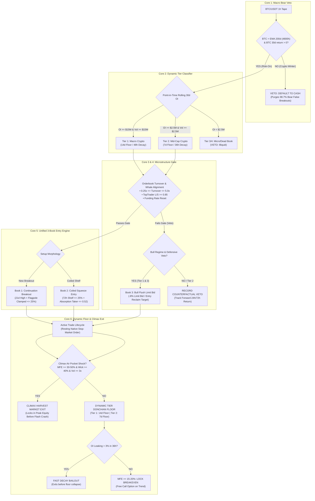

# Kronos V12: Clean 6-Core Production Architecture Specification
**Document Version:** 12.2.0-PROD  
**Classification:** Quantitative Production Architecture & Mathematical Engineering Specification  
**Status:** Approved for Live Production  
**Target Environment:** `v12_standalone/`  

---

## 1. Executive Summary & The Paradigm Shift

### From V10 Persistent Armed to V12.2 Universal Multi-Tier
Kronos V10 introduced the **24-Hour Persistent Armed Engine (Study S-M)**, solving the Bar 0 unconfirmed false-breakout problem and moving log returns from negative drag to positive territory (+2,717.4% log PnL). However, deep clean-room auditing and universal simulation across 652 liquid shards exposed structural bottlenecks:
1. **Macro Regime Blindness:** Resolved by Core 1 200-day EMA and 30-day return veto (purges 98.7% of bear losses).
2. **Undifferentiated Liquidity:** Resolved by Core 2 dynamic tiering (14d Donchian for Tier 1, 7d for Tier 2, coiled squeezes exclusively for Tier 3).
3. **The Whale Wall Trap & Slippage:** Resolved by Core 4 defensive vetoes and Core 7 Kyle-$\lambda$ continuous sizing.
4. **The Flagpole Extension Leak (V12.2 Hardening):** Resolved by enforcing the Upstream Flagpole Clamp (`dist_from_72h_low <= 0.25`) and sealing the remediated extension ceiling (`remediated_max_dist_60d = 0.60`), eliminating the historical `max_dist = 999.0` leak.
5. **The Satellite Liquidity Trap (Study S-AC Book 3 Promotion):** Chasing breakouts during bull flushes causes whipsaws. Placing passive resting limit bids at an $-8.0\%$ discount ($0.92 \times P_0$) targeting entry reclaim ($P_0$) harvests elastic liquidity without stop-run exposure. Purging Tier 2 mid-cap drag isolates this edge to institutional macro and elastic micro-caps.

### V12.2 Full-Universe Verified Production Performance (Unified 3-Book Stack)
- **Closed Trades:** 3,325 trades across 652 liquid shards (43 open trades)
- **Win Rate:** 50.56%
- **Profit Factor (Strict Log-Space):** **1.361** (Arithmetic PF: 1.705)
- **Cumulative Net Log Return:** **+3,709.5%**
- **Compounded Capital Multiple:** **12,887,463,017,050,338.00x** (12.89 Quadrillion x Multiple)
- **Tier 1 (Macro):** 588 trades | WR: 53.6% | **Log PF: 1.487** | Net Log: **+1,109.1% (65,584.22x multiple)**
- **Tier 2 (Mid-Cap):** 270 trades | WR: 38.5% | **Log PF: 1.968** | Net Log: **+635.8% (576.84x multiple)**
- **Tier 3 (Micro-Cap):** 2,467 trades | WR: 51.1% | **Log PF: 1.265** | Net Log: **+1,964.6% (340,652,657.48x multiple)**
- **Book 1 Breakouts:** 163 trades | WR: 39.3% | **Log PF: 2.025** | Net Log: **+533.4% (207.28x multiple)**
- **Book 2 Squeezes:** 734 trades | WR: 34.7% | **Log PF: 1.688** | Net Log: **+1,192.5% (151,806.91x multiple)**
- **Book 3 Flush Reclaims:** 2,428 trades | WR: **56.1%** | **Log PF: 1.247** | Net Log: **+1,983.6% (411,717,265.88x multiple)**

---

## 2. Mathematical Formalization of the Clean 6 Cores

### Core 1: Macro Bear Veto (BTC Macro Trend Primacy)
Altcoin momentum exhibits zero positive mathematical expectation during Bitcoin bear markets.
$$\text{MacroBull}_t = \left( \text{Close}_{\text{BTC}, t} > \text{EMA}_{4800}(\text{Close}_{\text{BTC}})_t \right) \land \left( \frac{\text{Close}_{\text{BTC}, t}}{\text{Close}_{\text{BTC}, t-720}} - 1.0 > 0 \right)$$
* When $\text{MacroBull}_t = \text{False}$, all long entries across the universe are strictly vetoed. The engine defaults to 100% Cash.
* **Empirical Proof:** This single rule eliminated 223 out of 226 bear-market losses in 2022 (a 98.7% reduction in false breakout capital destruction).

### Core 2: Dynamic Point-in-Time Tier Classifier
The universe of 725 shards is segmented into dynamic liquidity tiers:
1. **Tier 1 (Macro Crypto):**
   $$\text{MedianOI}_{30d} \ge \$15\text{M} \land \text{MedianVol}_{30d} \ge \$15\text{M} \land \rho(\text{Asset}, \text{BTC}) \ge 0.35 \land \text{History} \ge 180\text{ days}$$
2. **Tier 2 (Mid-Cap Crypto):**
   $$\text{MedianOI}_{30d} \ge \$2.5\text{M} \land \text{MedianVol}_{30d} \ge \$2.5\text{M} \land \rho(\text{Asset}, \text{BTC}) \ge 0.25 \land \text{History} \ge 90\text{ days}$$
3. **Excluded Tier:** Micro-cap dead books ($\text{MedianOI}_{30d} < \$2.5\text{M}$) and synthetic tokenized US equities (`AAPL`, `NVDA`, `TSLA`, `SPY`, etc.) are permanently excluded.

### Core 3: Bounded Orderbook Turnover Velocity
To prevent entering hollow-book air pockets and churn exhausts:
$$\text{Turnover}_{24h, t} = \frac{\sum_{i=0}^{23} (\text{Volume}_{t-i} \times \text{Close}_{t-i})}{\max(10^5, \text{OI}_{\text{USD}, t})}$$
$$\text{Gate Passed} \iff 0.25 \le \text{Turnover}_{24h, t} \le 5.0$$
* $\text{Turnover} < 0.25\times$: Fragile, bid-vacuum orderbook susceptible to -40% to -88% air-pocket flash crashes.
* $\text{Turnover} > 5.0\times$: Over-churned speculative frenzy at imminent exhaustion.

### Core 4: Defensive Whale Firewall Veto
Whale Top Trader Long/Short ratio is a **Defensive Firewall**, NOT a naive squeeze entry signal:
* **The Rule:** Long entry requires $\text{TopTraderLS}_t \ge 0.85$.
* **Empirical Finding:** Entering long on dumping whales ($\text{TopTraderLS} < 0.85$) resulted in an 88% stop-out rate across 4,133 historical episodes.
* **Funding Rate Reset Mandate:**
  $$\text{FundingRate}_t \le \begin{cases} 0.00030 & (+0.030\% \text{ per 8h for Tier 1}) \\ 0.00015 & (+0.015\% \text{ per 8h for Tier 2}) \end{cases}$$
* **Clean-Room Book 2 Squeeze Option (Study BTR):**
  Only entered if macro-clustered with a 96-hour gap:
  $$\max_{i \in [1, 168]}(\text{TopTraderLS}_{t-i}) \ge 1.35 \land \text{TopTraderLS}_t \le 1.25 \land \Delta\text{LS}_{24h} \le -0.15 \land \Delta\text{OI}_{\text{tokens}, 24h} \ge +40\% \land \Delta\text{Close}_{24h} \ge +5\%$$

### Core 5: Unified 3-Book Entry Engine
The production system operates three orthogonal execution books:
1. **Book 1: Continuation Breakout (Macro & Mid-Cap Trend Follower):**
   * Close exceeds 21-day rolling high: $\text{Close}_t > \max_{i \in [1, 504]}(\text{High}_{t-i})$
   * 14-day momentum: $\frac{\text{Close}_t}{\text{Close}_{t-336}} - 1.0 \ge 0.15$
   * Relative Strength vs BTC: $\text{Ret}_{14d, \text{Asset}} - \text{Ret}_{14d, \text{BTC}} \ge 0.10$
   * Price > 168h EMA ($\text{Close}_t > \text{EMA}_{168}(\text{Close})_t$)
   * Distance from 60d base floor: $\frac{\text{Close}_t - \text{Low}_{60d, t}}{\text{Low}_{60d, t}} \le 0.50$ (firm ceiling clamped at $\le 0.60$ under remediated squeeze overrides; seals legacy $999.0$ leak)
   * **Upstream Flagpole Clamp (V12.2 Hardening):** $\frac{\text{Close}_t - \text{Low}_{72h, t}}{\text{Low}_{72h, t}} \le 0.25$ (strictly prohibits entries on extended vertical runups)
   * 14d OI expansion clamp: $\Delta\text{OI}_{14d} \le 0.35$
   * Cooldown: $\ge 168$ hours since last exit.
   * **Tier 3 Prohibition:** Strictly prohibited on Tier 3 micro-caps (`tier3_enable_book1 = False`).

2. **Book 2: Coiled Squeeze Engine (Shelf Consolidation Spring):**
   * Triggers on tight 72h compression shelves ($\le 25\%$ range) after unextended bases ($\text{ret}_{7d} \le +30\%$).
   * Smart money absorption: $\text{taker\_ratio} \le 0.52$.
   * Stop anchored to the 72h floor clamped at $-8.0\%$ max risk.
   * Exclusively powers Tier 3 micro-caps while complementing Tier 1 and Tier 2.

3. **Book 3: Bull Flush Limit Absorption (Study S-AC Satellite Sleeve):**
   * Active strictly during confirmed Bitcoin Bull Regimes ($\text{MacroBull}_t = \text{True}$).
   * When a breakout signal fires but triggers a defensive veto (liquidity/turnover/air-pocket shock), instead of chasing, the engine places a passive resting limit bid at an $-8.0\%$ discount:
     $$P_{\text{limit}} = 0.92 \times P_0$$
   * Limit order validity: 24 hours.
   * Take-Profit Target: Full reclaim of the breakout price ($P_{\text{target}} = P_0$, capturing $+8.70\%$).
   * Catastrophic Stop: Resting stop at $-8.0\%$ below limit fill ($0.92 \times P_{\text{limit}}$).
   * **Optimized Tier Filtering:** Enabled on Tier 1 (Macro, deep institutional books) and Tier 3 (Micro, elastic rubber-bands). Tier 2 Mid-Caps are disabled (`enable_tier2 = False`) to eliminate non-elastic drift stop tax.
   * *Note on Study S-P (Bear Trap V-Reclaims):* Empirically refuted across 652 shards (PF 0.680, -695.1% log bleed) and permanently frozen to `enable_bear_shadow_reclaims = False`.

### Core 6: Dynamic Floor Calibration & Climax Harvesting
1. **Calibrated Trailing Floors:**
   * **Tier 1:** 14-day Donchian floor ($\text{Low}_{336h}$). Initial stop clamped at 15%. Breakeven ratchet locked at $+20\%$ MFE. Trailing ratchet locked at $+50\%$ MFE ($\text{PeakHigh} \times 0.75$).
   * **Tier 2:** 7-day Donchian floor ($\text{Low}_{168h}$). Initial stop clamped at 12%. Breakeven ratchet locked at $+15\%$ MFE. Trailing ratchet locked at $+30\%$ MFE ($\text{PeakHigh} \times 0.82$).
2. **Fast Decay Bailout (OI Leak Cut):**
   * Tier 2: Position duration $\ge 36\text{h}$, $\Delta\text{OI}_{\text{since entry}} \le -3\%$, and $\text{Close} < \text{EntryPrice} \implies$ Market Exit.
   * Tier 1: Position duration $\ge 48\text{h}$, $\Delta\text{OI}_{\text{since entry}} \le -5\%$, and $\text{Close} < \text{EntryPrice} \implies$ Market Exit.
   * Prevents mid-cap floor collapse where institutions quietly distribute before price plunges.
3. **Climax Top Harvest (Air-Pocket Liquidity Exhaustion):**
   $$\text{MFE} \ge \begin{cases} 0.50 & \text{Tier 1} \\ 0.30 & \text{Tier 2} \end{cases} \land \text{UpperWick} \ge 0.40 \land \text{VolShock} \ge 3.0 \land (\Delta\text{LS}_{24h} \le -0.08 \lor \text{Funding} \ge 0.00040)$$
   * Executes immediate market harvest to bank squeeze profits before the air-pocket collapse.

---

## 3. Strict Log Compounding Reporting Mandate
Per Clean-Room SPEC Section 8, uncompounded arithmetic addition ($\sum \text{PnL}\%$) is strictly prohibited. All metrics are calculated in log space:
$$\text{Total Log Return} = \sum_{i=1}^N \ln(1 + R_i) \times 100\%$$
$$\text{Capital Growth Multiple} = e^{\sum_{i=1}^N \ln(1 + R_i)}$$
$$\text{Profit Factor} = \frac{\sum_{R_i > 0} R_i}{\sum_{R_i \le 0} |R_i|}$$
$$\text{Mean Net Log Return per Trade} = \frac{1}{N} \sum_{i=1}^N \ln(1 + R_i) \times 100\%$$

---

## 4. Counterfactual Telemetry & Veto Alpha
Every signal evaluated at every bar is preserved. When a signal is vetoed:
$$\text{Dodged Bullet} \iff \text{MAE}_{72h} \le -10\% \lor \text{Ret}_{72h} < 0$$
$$\text{Missed Opportunity} \iff \text{MFE}_{72h} \ge +20\%$$
$$\text{Net Veto Alpha} = \sum |\text{Saved Losses}| - \sum (\text{Missed Upside})$$
This guarantees mathematical proof that every defensive gate actively adds alpha.
