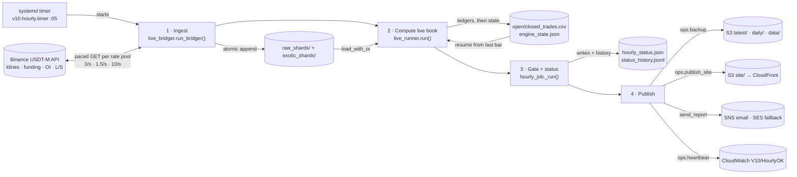
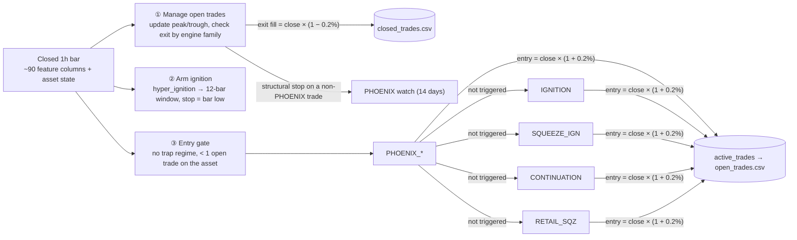

# Momentum Finder architecture

This page covers how the V10 momentum engine runs each hour, what each engine does, and which file and function handles every job. A browsable version with diagrams is in [`docs/code-map.html`](code-map.html); download it and open it in a browser.

Contents: [Hourly run](#1-the-hourly-run) · [One bar through the engine](#2-one-hourly-bar-through-the-engine) · [Engines](#3-the-six-engines) · [Features](#4-features) · [Modules](#5-every-module-by-job) · [Data files](#6-data-files) · [Dashboard](#7-dashboard) · [Deployment](#8-deployment) · [Code that never fires](#9-code-that-exists-but-never-fires) · [Backtest](#10-costed-backtest)

## 1. The hourly run

Everything in production starts from one systemd timer at five past each hour. `hourly_job._run()` runs four phases in order. When a phase fails, the failure is recorded in the run status rather than crashing the job.



The ledgers are written before `engine_state.json`, so if the job crashes it replays that hour instead of losing exits. A file lock (`io_utils.run_lock`) makes a second, overlapping run exit with code 3.

| Phase | What happens | Key functions |
|---|---|---|
| **1 · Ingest** | Loads symbols, funding schedules and funding intervals once. Then, in threads per symbol: fetches new closed 1h candles; fetches funding only after a settlement has closed; fetches OI and top-trader long/short (Binance keeps 30 days). Every write is atomic, and watermarks are kept in `SyncStateManager`. | `run_bridger`, `get_symbols`, `prefetch_global_funding`, `process_symbol`, `_update_klines`, `_kline_limit`, `funding_call_needed`, `_update_funding`, `_update_metrics`, `_fetch_metrics_pages`, `_append_shard` |
| **2 · Compute** | Finds the assets and loads saved state. Then, in a process pool per asset: joins price with OI, long/short and funding; runs the circuit breaker (720+ bars, current data, no bad prices); computes features over the full history; runs `step_cta` on each *new, closed* bar. Closed trades are de-duplicated and appended, and the open book is rebuilt. | `live_runner.run`, `discover_assets`, `process_live_asset`, `load_with_oi`, `validate_asset_data`, `compute_features`, `bar_is_closed`, `step_cta`, `dedupe_new_trades`, `active_trade_record`, `effective_stop` |
| **3 · Gate + status** | Stops early if there are fewer than `V10_MIN_SHARDS` shards. Rebuilds `all_trades.csv` and the list of entries from the last 24h. The run is `ok` only if at least 80% of shards hold the latest bar and at most 20% of assets or symbols failed. Writes the status and appends it to the history. | `write_all_trades_view`, `new_signals`, `raw_fresh_pct`, `append_status_history` |
| **4 · Publish** | Backs up the ledgers and state every hour (`latest/`), plus `daily/` at 00 UTC and a shard mirror once a day. Exports and uploads the dashboard, sends the email and records the heartbeat metric. | `ops.backup`, `ops.publish_site` → `site_export.export_site`, `send_report` → `render_report` / `send_report_sns`, `ops.heartbeat` |

## 2. One hourly bar through the engine

`cta_dual.step_cta(ts, row, state, cfg, asset)` holds the whole trading logic. It runs once per closed bar per asset, using that asset's saved state: open trades, the ignition "armed" countdown, and the PHOENIX watch list.



Exits are always checked before entries. PHOENIX is tried first, and if it fires the other engines are skipped for that bar. Every entry also needs `is_idiosyncratic` (30-day BTC correlation < 0.5) and `has_long_memory_accumulation` (the fractionally differenced order-flow measure, `fd_ofi`, is above 0).

## 3. The six engines

The thresholds are hard-coded in `cta_dual.step_cta` and `compute_features`. See [section 9](#9-code-that-exists-but-never-fires) for the `CtaConfig` settings that aren't wired in.

| Engine | Enters when | Initial stop | Exits (reason in the ledger) |
|---|---|---|---|
| **IGNITION** | The asset is armed: a *hyper_ignition* bar happened within the last 12 bars (volume shock above its own 1-year p99, dormant order book, close above the 24h high). On this bar there is also aggressive taker flow, institutional-sized trades, no whale trap, no extension beyond 2× ATR without OI confirmation, and funding ≥ 0. | Low of the ignition bar | Close below the stop, unless funding is above its own p99 (`structural_stop`). In a toxic regime: 25% below the peak once up 5% (`toxic_trail`), or −20% (`toxic_hard`). |
| **SQUEEZE_IGN** | As IGNITION, but funding < 0, plus funding still falling or a 3σ burst of taker buying. | −20% | Toxic regime (`regime_bailout`); close below −20% (`20pct_hard_stop`); 25% below the peak once up 5% (`25pct_trailing_stop`). |
| **CONTINUATION** | `continuation_long` is true: close above SMA-200, a 24h breakout, aggressive flow, institutional-sized trades, a bar range over 2.5× the 30-day average, OI change above its 30-day p90, no whale trap, and funding not overheated. | Low of the entry bar | Close below whichever is higher: the stop, or the 21-day low once the peak gain reaches +50%. Recorded as `donchian_trail` or `structural_stop`. |
| **RETAIL_SQZ** | `retail_squeeze_long` is true: uptrend and breakout with aggressive flow, but *not* institutional-sized; top traders net short (L/S < 1); OI down more than 5% (liquidations); and a fat-tailed asset (Hill α ≤ 2.5). | −20% | As SQUEEZE_IGN |
| **PHOENIX_IGNITION / PHOENIX_CONTINUATION** | Within 14 days of a structural stop on the original engine, the close climbs back above the original entry, with aggressive flow. | Low of the re-entry bar (−20% if the original trade was a squeeze) | As its family. A PHOENIX stop-out does not add another PHOENIX watch. |

A trap regime blocks new entries. In practice that means `is_toxic_distribution`: the 90-day order-flow z-score is below −1.5. Fills are the bar close with 0.2% slippage in the trade's direction.

## 4. Features

Features are computed once per asset over its full history, then stepped through bar by bar. All baselines stop at the previous bar (`shift(1)`), so no bar is computed with data from after it.

| Function | Columns it adds | Used by |
|---|---|---|
| `features.load_asset` | Reads a 1h shard, with epoch-ms timestamps converted to the index | `load_with_oi` |
| `universe_generator.load_with_oi` | From the metrics shard: `sum_open_interest`, `oi_change`, `sum_open_interest_value`, `topLongShortAccountRatio`. From the funding shard: `funding_rate`. All hourly and forward-filled. | live_runner, build_v10_tape, universe_generator |
| `features.enrich` | `shock_mult` (volume ÷ its 24h average), `shock_thresh` (the asset's own 1-year p99), `is_dormant_book` (30-day median notional below the 1-year median), `breakout`/`breakdown` (vs the 24h high/low), `taker_ratio`, `is_aggressive_flow`, `hyper_ignition`, `strict_ignition`, `ignition_signal` | `compute_features` |
| `fd_ofi.compute_fd_ofi_kernel` | Numba kernel for fractionally differenced order-flow imbalance (d = 0.45, window 100), stored as `fd_ofi` | `compute_features` |
| `cta_dual.compute_features` | `is_3sigma_taker`; `btc_corr` → `is_idiosyncratic`; `has_long_memory_accumulation`; `sma_200`/`is_uptrend`; `ext_mult` (the 4h move ÷ 24h ATR); `whale_trap`; `funding_p99`, `is_overheated`, `funding_accelerating_negative`; `is_institutional_flow` (average trade size above its 30-day p90); `oi_value_change`; `is_aggressive_flow_quote`; `macro_z_score` → `is_toxic_distribution`; `continuation_long`; `retail_squeeze_long` (with `get_hill_estimator`); `donchian_low_504`; `is_early_stage` | `step_cta` |
| `bar_clock.bar_is_closed` | A bar that opens at T counts only once now ≥ T + 1h | live_runner |

## 5. Every module, by job

**Live** runs in the hourly job, **research** is run by hand, and **legacy** is kept for reference only.

### Schedule and orchestration
| File | Functions / blocks | What it does |
|---|---|---|
| `deploy/v10-hourly.timer`, `.service` (live) | `OnCalendar *:05` | Starts the job as user `v10` with a read-only code tree. Exit code 3 (a run is already in progress) doesn't count as a failure. |
| `momentum_v10/hourly_job.py` (live) | `main`, `_run`, `raw_fresh_pct`, `render_report`, `send_report`, `send_report_sns` | Takes the run lock, runs the four phases and measures how fresh the data is. Builds the email, including the new-signals table, and sends it via SNS, falling back to SES. |

### Market data ingestion
| File | Functions / blocks | What it does |
|---|---|---|
| `config/ingestion/live_bridger.py` (live) | `run_bridger`, `process_symbol`, `api_get`, `get_session`, `prefetch_global_funding`, `funding_call_needed`, `_update_klines`, `_kline_limit`, `_update_funding`, `_update_metrics`, `_fetch_metrics_pages`, `_append_shard`, `safe_read_parquet` | Brings every shard up to the last closed hour, pacing requests per Binance rate pool. It also: <br>• stops on HTTP 418/451 (`IpBannedError`) <br>• skips delisted contracts <br>• quarantines corrupt shards <br>• sweeps orphaned `.tmp` files |
| `config/ingestion/sync_state_manager.py` (live) | `SyncStateManager` (`get`, `set`, `save`), `build_sync_state` | Keeps the last-fetched timestamp per symbol and stream in `sync_state.json`, and can rebuild it from the shards. |

### Signals and trading logic
| File | Functions / blocks | What it does |
|---|---|---|
| `momentum_v10/config.py` (live) | `DATA_ROOT`, `SHARD_DIR`, `TAPE_DIR`, `FeatureConfig`, `CtaConfig`, `DONCHIAN_*` | Paths (taken from `V10_DATA_ROOT`) and settings. Live runs use a p99 volume shock, the relative dormant-book test, a taker buffer of 0.01 and first-of-run de-duplication. |
| `momentum_v10/features.py` (live) | `load_asset`, `enrich` | The shared feature core that only uses past data (section 4). |
| `momentum_v10/fd_ofi.py` (live) | `compute_fd_ofi_kernel` | Numba-compiled order-flow kernel. |
| `momentum_v10/cta_dual.py` (live) | `compute_features`, `get_hill_estimator`, `step_cta`, `run_cta` | Computes every engine flag, then runs the per-bar logic (section 2). `run_cta` steps through a whole history for research and marks trades still open at the end as `open_at_end`. |
| `momentum_v10/bar_clock.py` (live) | `bar_is_closed`, `drop_forming_*` | Makes sure the engine never trades the hour that's still forming. |

### Live book
| File | Functions / blocks | What it does |
|---|---|---|
| `momentum_v10/live_runner.py` (live) | `run`, `process_live_asset`, `validate_asset_data`, `effective_stop`, `active_trade_record` | Steps each asset forward from its saved state. On bad data it skips new trading for that asset but keeps its open positions. Writes the ledgers, then the state. Open rows carry the current price, stop, distance to the stop and age. |
| `momentum_v10/live_book.py` (live) | `trade_key`, `dedupe_new_trades`, `count_open`, `count_closed`, `preserve_research_open`, `new_signals` | Ledger helpers: no duplicate exits after a cold start, counts that ignore `open_at_end` rows, and the list of new entries from the last 24h. |
| `momentum_v10/universe_generator.py` (live + research) | `discover_assets`, `load_with_oi`, `process_asset`, `render_tear_sheet`, `compute_scorecard`, `contextual_reason` | The live job uses asset discovery and the data join. Its `main` runs the full engine over every asset in parallel and prints Markdown tear sheets (research). |
| `momentum_v10/build_csv.py` (live) | `write_all_trades_view` | Combines the open and closed ledgers into `all_trades.csv`. |
| `momentum_v10/book_store.py` (research) | `build_trades`, `build_scorecard`, `write_book`, `render_asset` | Writes `trades.parquet` and `scorecard.parquet`, and renders one asset's tear sheet. |

### Operations, publishing and plumbing
| File | Functions / blocks | What it does |
|---|---|---|
| `momentum_v10/ops.py` (live) | `backup`, `restore`, `heartbeat`, `publish_site`, `ledger_files`, `shard_files` | Backs up to S3 and restores from it (which also seeds a new host). Sends the CloudWatch heartbeat and uploads the dashboard. CLI: `backup`, `restore`, `backup-all`, `publish-site`. |
| `momentum_v10/site_export.py` (live) | `export_site`, `dna_map`, `patched_html`, `_clean` | Writes `site/index.html` and `data/*.json` (with NaN replaced so the JSON is valid), plus the per-asset tail index used by Asset DNA. |
| `momentum_v10/dashboard_data.py` (live) | `build_trades`, `build_meta`, `build_config`, `append_status_history`, `latest_bar_utc`, `data_file` | Turns the ledgers into the dashboard's JSON (one row format for open and closed trades), keeps the last 500 run statuses and exposes the engine parameters. |
| `momentum_v10/io_utils.py` (live) | `atomic_to_parquet`, `atomic_to_csv`, `atomic_write_text`, `RateLimiter`, `run_lock` | Atomic writes (temp file, fsync, rename), thread-safe request pacing and the single-run lock. |
| `momentum_v10/logger.py` (live) | `init_logging`, `get_logger`, `check_disk_space`, `quarantine_corrupted_shard` | Rotating logs plus a separate trade-audit log; moves corrupt shards aside. |

### Dashboard
| File | Functions / blocks | What it does |
|---|---|---|
| `momentum_v10/dashboard_v10.html` (live) | see section 7 | The static page served by CloudFront. |
| `momentum_v10/dashboard_server.py` (local) | `TradoorHandler.do_GET`, `run_server`, `build_api_response`, `calc_point_72` | Local preview on 127.0.0.1:8050. It serves the page and `/data/*.json` built live from the ledgers, and returns 404 for everything else. The old `/api/data` endpoint is kept. |

### Research and reporting
| File | Functions / blocks | What it does |
|---|---|---|
| `momentum_v10/backtest_costed.py` (research) | `extract`, `simulate`, `metrics`, `run_report`, `per_trade_costed`, `Params`, `_slip`, `_funding` | Replays the ledger's signals as one account, with costs and position sizing (section 10). |
| `momentum_v10/backtest_report.py` (research) | `render`, `main` | Renders `results.json` as a single HTML page. |
| `build_v10_tape.py` (research) | `process_asset`, `main` | Runs the engine over the full history of every shard and writes `master_raw_tape.csv`. |
| `momentum_v10/l5_generator.py` (research) | `generate_l5_rankings` | Builds cross-sectional relative-strength ranks into `l5_ranking.parquet`. They are read into a column that no engine uses. |
| `pipeline_v10.ps1` (research) | 5 steps | Windows research rebuild: bridger → live_runner → build_v10_tape → build_csv → Markdown reports. |
| `generate_artifact.py`, `build_open_artifact.py` (research) | scripts | Write Markdown summaries of the closed and open books. |

### Legacy and disabled
| File | Functions | Status |
|---|---|---|
| `cta.py`, `cta_armed.py`, `cta_concurrent.py` | `compute_features`, `run_cta` | Earlier engine versions, marked DEPRECATED. |
| `scan.py`, `tape.py`, `outcomes.py` | `scan_asset`, `build_tape`, `event_stats` | Old ignition scanner and forward-outcome labels. |
| `experiments/baseline.py`, `exp_avwap.py`, `exp_fuel.py` | `compute_features`, `run_cta` | One-off V6 dual-engine experiments. |
| `dashboard.py` (Streamlit), `dashboard_nicegui.py` | `load_trades`, `calc_point_72` | Earlier dashboards; the Asset DNA tail estimator started here. |
| `websocket_daemon.py` | `main` | Disabled: it exits with code 2. It used to append partial candles and corrupted the shards. |

## 6. Data files

All paths are under `V10_DATA_ROOT`: `/var/lib/v10/data` on the server, `<repo>/data` locally. Every write is atomic.

| File | Written by | Read by |
|---|---|---|
| `raw_shards/{A}_USDT_1h.parquet` | `live_bridger._update_klines` | `load_with_oi`, `raw_fresh_pct`, `dna_map`, `l5_generator`, backtest `extract` |
| `exotic_shards/{A}USDT_funding.parquet`, `exotic_shards/{A}USDT_metrics.parquet` | `_update_funding`, `_update_metrics` | `load_with_oi`, backtest `extract` (funding) |
| `sync_state.json` | `SyncStateManager` | `live_bridger`, `dashboard_data.latest_bar_utc` |
| `engine_state.json` | `live_runner.run` (after the ledgers) | `live_runner.run` the next hour |
| `all_tapes/v10_production/closed_trades.csv` | `live_runner.run` (append, de-duplicated) | `dashboard_data`, `build_csv`, backtest, reports |
| `…/open_trades.csv` | `live_runner.run` (rebuilt each hour) | `dashboard_data`, `new_signals`, backtest |
| `…/all_trades.csv` | `build_csv.write_all_trades_view` | `dashboard_server` `/api/data` (legacy) |
| `…/research_open_at_end.csv` | `live_book.preserve_research_open` | Read by people, for research |
| `…/hourly_status.json`, `status_history.jsonl` | `hourly_job`, `append_status_history` | `build_meta` (Reports page), the email |
| `…/trades.parquet`, `scorecard.parquet` | `book_store.write_book` | `book_store.render_asset` |
| `l5_ranking.parquet` | `l5_generator` | `compute_features` (into an unused column) |
| `quarantine/` | `quarantine_corrupted_shard` | Read by people |
| `site/` (outside the data root) | `site_export.export_site` | `ops.publish_site` → S3 `site/` |
| S3 `v10/latest/`, `daily/`, `data/` | `ops.backup` | `ops.restore` |

## 7. Dashboard

`dashboard_v10.html` is a single file. `loadData()` fetches `data/trades.json` and `meta.json`. Every panel is computed in the browser from the rows that pass through `currentRows()`, in this order: **mode → time range → filters → search → sort**.

| On screen | JavaScript | Behaviour |
|---|---|---|
| Open / Closed / All buttons, sidebar | `setMode`, `navigate`, `showView` | Chooses which rows to show (open, closed or both), or switches to the Engines, Risk, Reports or Settings view. |
| 1D · 7D · 30D · ALL · Custom, date box | `setRange`, `rangeWindow`, `inRange`, `toggleCustomRange`, `applyCustomRange` | The window ends at the newest closed bar. Open trades are filtered by entry time, closed trades by exit time. |
| KPI cards and sparklines | `renderKpis`, `renderSparks`, `dailyBuckets` | Count, win %, cumulative and mean PnL, top runner. Each sparkline uses 30 daily buckets. |
| Trend chart and its time buttons | `renderTrend`, `setTrendRange` | Cumulative PnL by exit time (closed) or entry time (open). |
| Engine donut, holding-time bars | `renderDonut`, `renderDurations` | Share of trades by engine; age or holding-time buckets. |
| New Signals panel | `renderSignals` | Open trades entered in the last 24h, with stop and distance to stop. |
| Table, headers, pager | `renderTable`, `sortSpec`, `renderPager`, `changePage` | Click a header to sort. Date columns sort as times, and blanks go last. |
| Filters panel | `toggleFilters`, `applyFilters`, `resetFilters`, `passesFilters` | Engines, winners/losers, within 5% of the stop, older than 30 days. |
| Search box | input listener → `currentRows` | Matches asset, engine, exit reason or trade number. |
| Checkboxes, Export | `toggleRow`, `toggleSelectAll`, `exportCsv`, `toCsv` | Exports the selected rows, or every filtered row if none are selected. |
| Row buttons 📈 · 📋 · ⋮ | Binance link, `copyRow`, `openTrade` | 📈 opens the Binance futures chart, 📋 copies a one-line summary, ⋮ shows trade details with a description of the engine. |
| Engine Performance | `renderEngines`, `scorecard` | Expectancy per engine, exit reasons, and how concentrated the profits are. |
| Risk Monitor | `renderRisk` | Positions near their stop, position ages, oldest positions, exposure. |
| Reports | `renderReports`, `downloadBook`, `downloadScorecard` | Last run, run history, results by year, CSV downloads. |
| Settings | `renderSettings`, `setPref`, `pref` | Rows per page, default sort and refresh interval (saved in the browser), plus the engine parameters from `config.json`. |
| Asset DNA | `openAssetDnaModal`, `fetchAssetDna` | Shows the Hill tail index from `asset_dna.json`: 3.19 or below is fat-tailed (valid); above that is vetoed. |
| Auto Refresh, clock | `toggleAutoRefresh`, `scheduleRefresh`, `updateClock` | Reloads the JSON every 60 seconds by default. The data itself only changes hourly. |

## 8. Deployment

- **`deploy/aws/deploy.sh`** (run from your own machine):
  - `deploy` creates the S3 bucket and lifecycle rules, SNS, the IAM role, a VPC if the account has no default one, the EC2 t4g.small and the CloudWatch alarm.
  - `update` packages the code (`build_release`) and runs `refresh.sh` on the server over SSM.
  - `dashboard` publishes the site and sets up CloudFront with origin access control, so the bucket stays private.
  - Also available: `run-now`, `status`, `logs`, `verify`, `diag`, `resubscribe`, and `destroy` (which keeps the bucket).
- **On the server:**
  - `bootstrap.sh` runs on first boot. It creates the `/opt/v10_venv` virtual environment and the `v10` user, runs `ops restore` and starts the timer.
  - `refresh.sh` unpacks a release into the read-only `/opt/v10_standalone`.
  - Settings live in `/etc/v10/v10.env`; the template is `deploy/v10.env.example`.
  - The only writable paths are `/var/lib/v10` and `/var/log/v10`.
- **Access:** `create-deployer-user.sh` and the `deployer-policy-*.json` files set up scoped IAM for whoever runs the deploy.
- **Alternatives:** the `Dockerfile` runs the same hourly job in a container, with the data mounted at `/app/data`.

## 9. Code that exists but never fires

None of these change what runs today. They explain gaps between the documented design and what the engine actually does.

- **The upper-wick filter and the exhaustion exit are inactive.** `step_cta` reads `upper_wick_ratio`, but nothing ever computes it, so it's always 0. The "wick ≤ 0.65" entry veto therefore always passes, and the `exhaustion` exit, which needs a wick above 0.40, can never trigger. None of the 4,009 closed trades exited as `exhaustion`.
- **Two trap regimes are never set.** The entry gate and the squeeze exits read `regime_euphoria` and `regime_dead_cat`, but nothing computes them. Only `is_toxic_distribution` actually blocks entries or triggers `regime_bailout`.
- **Most `CtaConfig` settings are not wired in.** `step_cta` reads only the Donchian fields, plus a `slippage` attribute that `CtaConfig` doesn't define, so the 0.2% default always applies. The −20%, +5% and 25% trail levels, the 12-bar arming window, the 14-day PHOENIX window, the 0.65 wick limit and the 0.8 OI ratio are all written directly into the code. Changing `hard_stop_pct`, `volume_shock_mult` or `max_ignition_wick_ratio` has no effect.
- **Some features are computed but never used:** `l5_rank_pctile` (the whole L5 ranking pipeline), `oversold_squeeze_long`, and `strict_ignition`/`ignition_signal` from `features.enrich`. The engines use `hyper_ignition` instead.
- **The toxic-trail exit books the trail level, not the price.** `exit_price = trade_max_high × 0.75`, even when the hourly close is lower. The costed backtest found these exits average +59.6% as booked, against +32.4% when filled at the next bar's open.

## 10. Costed backtest

The costed backtest replays the ledger's signals as one account:

- **Fills:** at the next bar's open.
- **Costs:** 0.05% taker fee per side, square-root market impact on top of a half-spread, and funding.
- **Sizing:** 0.5% of equity risked per trade, capped per position, by share of 24h volume, by gross exposure and by number of positions. Winning positions are trimmed back to 20% of equity.
- **Tests:** engine subsets, walk-forward, different start dates, and sensitivity to each assumption.

The latest report is [`docs/backtest/backtest-report.html`](backtest/backtest-report.html) (download it and open it in a browser), with its written findings in [`docs/backtest/findings.json`](backtest/findings.json). To regenerate it:

```bash
export V10_DATA_ROOT=../data V10_BT_DIR=../backtest
for i in 0 1 2 3 4 5 6 7; do python -m momentum_v10.backtest_costed extract $i 8; done
python -m momentum_v10.backtest_costed merge
python -m momentum_v10.backtest_costed report
python -m momentum_v10.backtest_report ../backtest docs/backtest/findings.json
```
